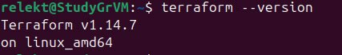
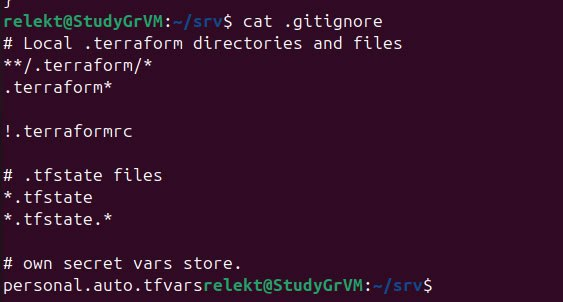
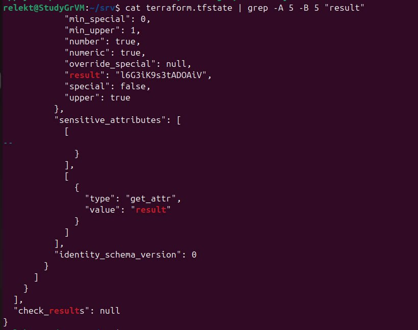
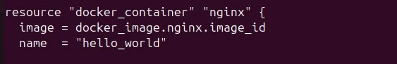
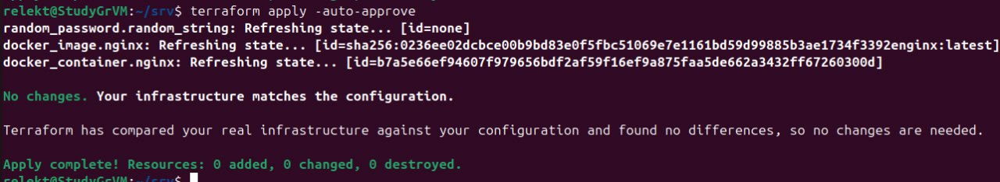
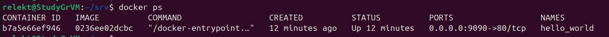
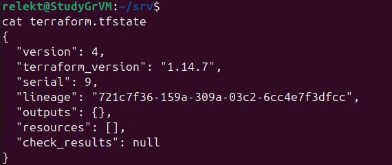
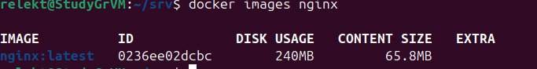

Задание 1

1. Подготовка окружения

Установлена версия Terraform:

2. Изучение .gitignore

Файл .gitignore

Согласно этому файлу, личную и секретную информацию (логины, пароли, токены) допустимо сохранять в файле personal.auto.tfvars, так как он явно указан в игнорируемых файлах и не попадёт в репозиторий.

3. Поиск секрета в state-файле

После выполнения кода проекта, в файле terraform.tfstate найден секрет от ресурса random_password: 

4. Исправление ошибок в коде

Был раскомментирован блок кода (строки 29–42 исходного файла).
Выполнена команда terraform validate
Найденные ошибки:
Отсутствует имя у ресурса docker_image
Имя ресурса docker_container начинается с цифры ("1nginx")
Ссылка на несуществующий ресурс random_password.random_string_FAKE
Опечатка в атрибуте: resulT вместо result
Исправленный фрагмент кода:

    resource "docker_image" "nginx" {
        name         = "nginx:latest"
        keep_locally = true
    }

    resource "docker_container" "nginx" {
        image = docker_image.nginx.image_id
        name  = "example_${random_password.random_string.result}"

    ports {
        internal = 80
        external = 9090
    }
    }

5. Выполнение кода и проверка

Замена имени контейнера на hello_world

Выполнен код terraform apply -auto-approve

Вывод docker ps:

6. Опасность ключа -auto-approve:

Ключ автоматически подтверждает выполнение всех изменений, описанных в плане Terraform, без запроса подтверждения у пользователя. Это может привести к:

случайному удалению важных ресурсов;

неожиданным изменениям инфраструктуры;

потере данных;

простою сервисов в production-среде.

Польза ключа -auto-approve:
Необходим для автоматизации в CI/CD пайплайнах, скриптах и неинтерактивных сессиях (например, при удалённом запуске через SSH).

7.  Уничтожение ресурсов

Выполнена команда terraform destroy -auto-approve
Содержимое terraform.tfstate после уничтожения:

Контейнер удален, а образ остался 

8. Почему не удалился образ nginx:latest?

В ресурсе docker_image указан параметр: keep_locally = true

Цитата из документации провайдера docker:

"keep_locally - (Optional, boolean) If true, the image will be kept when the resource is destroyed."

Это означает, что при уничтожении ресурса образ сохраняется локально.